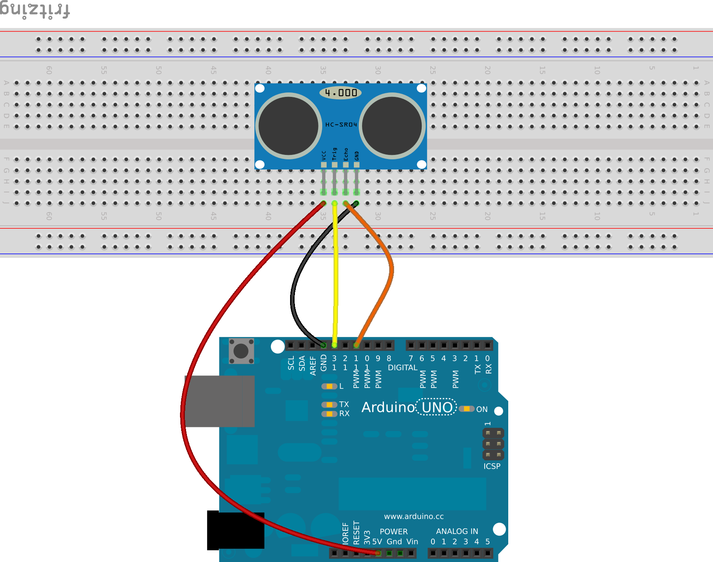

# Intruder detector

-------------

Detects if any intruder nears your computer with the help of Ultrasonic sensor and captures their image immediately
with the help of your USB Webcam.

### Setup

* Install the required python libraries from requirement.txt file

        sudo pip install -r requirements.txt

* Connect your Arduino board over USB and find the name of the port it is connected to (Usually this is **`/dev/ttyUSB0`** if there is only one device connected over USB).
* Open and Arduino IDE; Verify & Upload the sketch **`arduino/ultra_sonic_sensor.ino`** to the board.

## Running the program

        python python/capture_user.py /dev/ttyUSB0

Depending on the range you have set in the python script `capture_user.py` `RANGE` variable, the script will activate the camera, captures the image and saves it. You can find the image in your $HOME/image_captures/ directory
